# 新手向爬虫作业
  
  
  
## 做了什么
  
  
* 爬取2w歌单的名字和URL
* 爬取歌单里面每一首歌曲的第一页评论
* 用多线程加快爬取速度 
  
### 爬歌单==爬歌单名字？
  
  
一开始看到作业爬取网易云音乐至少20000条歌单信息，没想太多，直觉就是拿到2w条歌单名字和URL就完事了。但还是两眼一抹黑，就先按提示用Beautiful Soup爬了一下豆瓣的电影信息。练完手之后，开始正式去爬取网易云音乐的歌单信息。
  
#### 从哪里入手
  
  
爬取歌单，先得找到从哪个来源去获得歌单，可以从一些歌单汇总，或者是某一位用户收藏的歌单找到其他用户去辐射更多的歌单等等。我觉得第一种方式最简单易懂，就决定从歌单汇总的页面直接爬取。
  
首先我登录了网易云音乐的官网https://music.163.com/，然后发现有个歌单的页面，点击进入
  
>https://music.163.com/#/discover/playlist，
  
顺利发现这就是我要的类似歌单汇总的页面，然后我在页面进行探索（到处点点，看看URL怎么变，有没有什么参数）
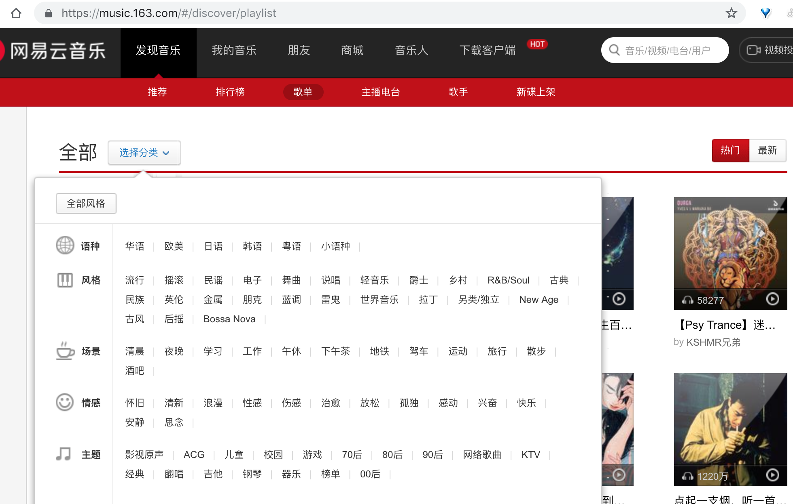
发现cat参数是选择分类，order参数是排序方式（热门还是最新），limit参数是每页歌单数量（固定35=5 * 7），offset参数和页数相关=(页数-1)*35
下面举一个例子：
>?order=hot&cat=全部&limit=35&offset=35，就是热门排序下全部分类下第二页的信息。
>>这里有一个提醒，直接爬https://music.163.com/#/discover/playlist
是爬不到,我们需要去爬取https://music.163.com/discover/playlist
具体原因我看到有回答是带#的URL只是静态的存储布局而并没有包含数据
  
  
所以一个分类有大概1000组歌单，爬完所有的分类除去一些重复的可以满足2w条要求。
  
#### 开始爬取
  
  
于是command+alt+c打开开发者工具，选择第一个歌单查看它html结构，发现如图所示：
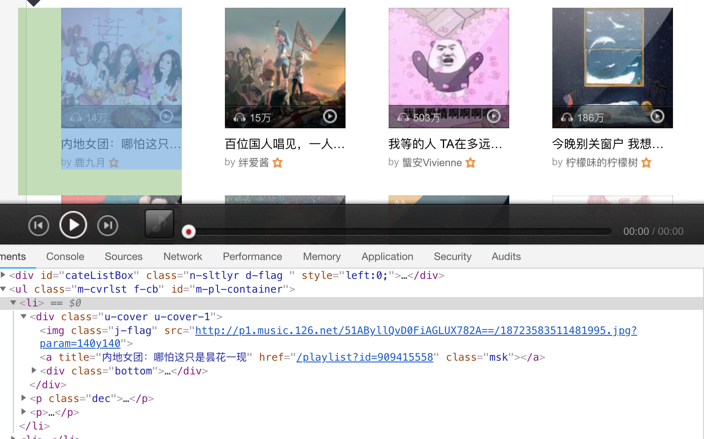
可以看到 href="/playList?id=909415558"里面就有我们需要的歌单id信息，然后去查看第二个歌单，发现结构是一模一样的，所以我直接采用正则匹配去找到所以该页歌单的id号（用来构造歌单的URL）
> 'playlist\?id=(\d+?)" class="msk"'
  
依法炮制，我们可以用正则去匹配当页所有歌单名字
> 'class="tit f-thide s-fc0">(.+?)\</a>'
  
然后就是怎么去一页一页爬取所有的歌单id和名字，这里有两种思路，一种是刚刚已经知道参数的含义，直接去构造下一页的URL即可，另外一种是在页面的下一页中已经写好了URL，我们可以直接取过来使用，这里我采用Beautiful Soup去直接取下一页的URL,如图所示：
> soup.find('a', class_='zbtn znxt')['href']
  
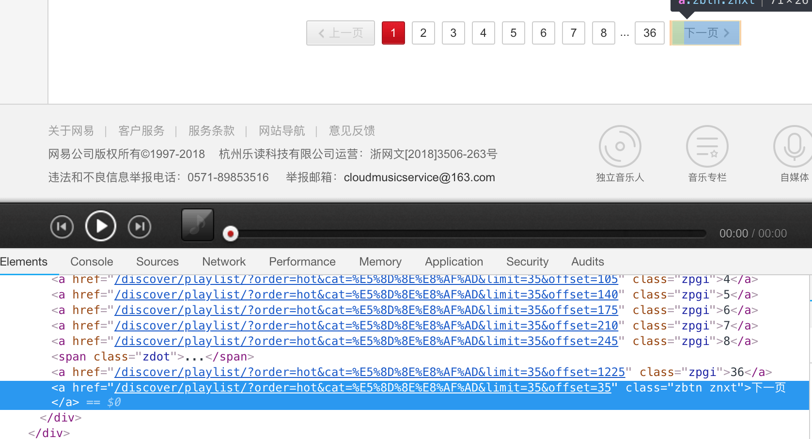
  
#### 爬取不同分类
  
  
已经完成了对一个分类的歌单去头到尾去爬取URL和名字，接下来可以直接构造多个分类的URL重复去完成以上操作
  
### 阴差阳错去爬评论
  
  
后来我觉得是不是理解错题目的意思了，于是看看要不要直接沿着爬歌单的路线深入一些去爬取一下热门的评论（网易云音乐的评论还是很有智慧的）
> 歌单-->歌曲-->评论
  
基本思路就是这样，在获取到当页所有歌单的URL和名字之后，我们可以依次去访问相应的歌单，然后同理打开开发者工具去观察歌曲html的相关结构，如图所示，打开歌单
>[内地女团：哪怕这只是昙花一现](https://music.163.com/#/playlist?id=909415558 )
  
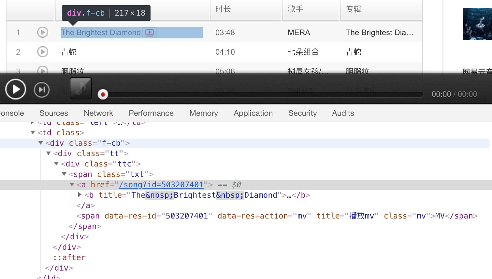
  
可以清楚的找到歌曲id来构造歌曲的URL以及歌名，这里因为有很多层嵌套，我还是采用正则去匹配（又快又方便）
>'song\?id=(\d+?)".+?\</a>'
'song\?id=\d+?">(.+?)\</a>'
  
然后下一步就是去爬取评论了,继续点击这个[The Brightest Diamond](（https://music.163.com/#/song?id=503207401） )这首歌曲，一开始我还是依样画葫芦，但是发现始终拿不到数据。于是requests一下打印出来，发现和F12的源码是不一样的
>（后面去试验了一下歌曲页面，同样是不一致的，但是id和名字都是有的，所以最开始才会成功）
  
然后我明白评论应该是ajax请求的动态加载，怎么办？要不直接上selenium直接爬，要不试着自己去观察是怎么请求的。
  
我这里选择了第二种方式。一开始还是老朋友，打开开发者工具,切换到NetWork页面选择XHR，command+R刷新一下页面，发现一堆东西，一个个点开看看，然后发现R_SO_4_503207401?csrf_token=好像就是返回我要找的评论，如图所示
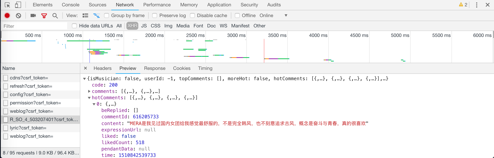
  
点开Headers,可以看到请求的URL和方法以及请求的参数，如图所示

  
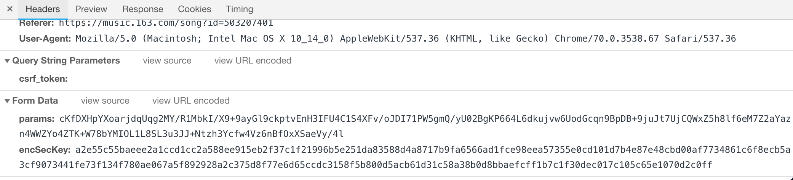
  
1. 发现请求URL包含的R_SO_4_503207401?csrf_token=里面503207401就是当前歌曲的id，所以怎么构造URL知道了。
2. 发现请求的参数是经过加密，十分复杂的，而且刷新页面和下一页（或者跳转其他评论页面）都会改变，但是有趣的是，现在拿到的这个请求参数可以对所有的歌曲生效，只要请求URL带上这个参数，也可以返回其他歌曲首页评论的JSON数据。但是如果需要爬取一首歌曲全部的评论呢？不单单只是想返回首页评论的信息，5000页的评论总不能提前复制好5000对加密过的参数吧，这也太辛苦了而且不优雅了。然后经过查询和一番实践之后，终于明白了2对参数的加密过程。
  
#### 参数如何加密的
  
  
还是在前面刚刚提到的开发者工具的NetWork页面的子项XHR之中，为了方便观察，可以重新刷新一次，可以看到目标对象R_SO_4_503207401?csrf_token=的各种状态，其中Initiator是一个js文件，也就是说这很有可能就是包含加密算法的js文件，如图所示
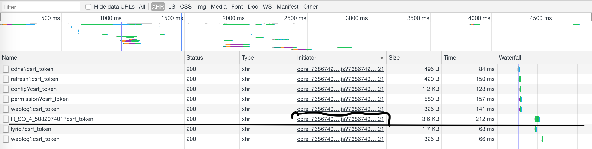
  
找到了对应的js文件，接下来就是去寻找加密算法的相关信息。
  
切换页面到JS，找到对应的文件core_...，点击查看详情，在Preview可以看到一个规范美化的js代码，然后已知两个加密参数分别是params和encSeckey，在Preview中command+f搜索该js代码中哪些地方出现params和encSeckey，一定和加密算法的过程息息相关，如图所示
  
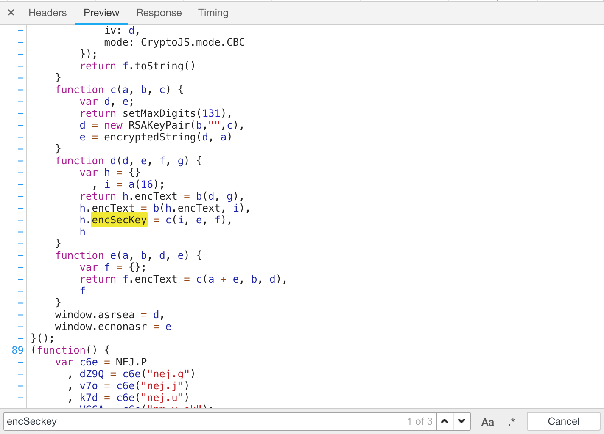
---
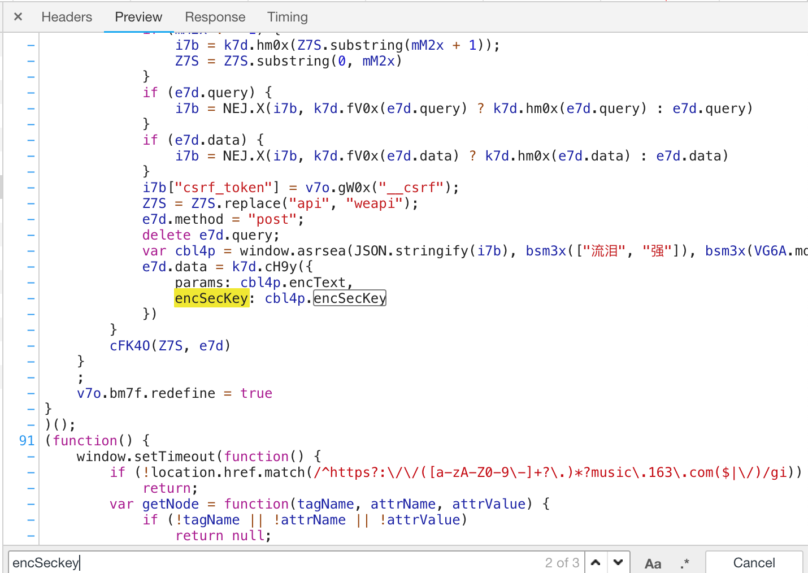
  
然后可以发现上一张截图是具体实现，下一张截图是调用window.asrsea()，这里我直接把相关代码段贴过来，方便观察。
  
```js
var cbl4p = window.asrsea(JSON.stringify(i7b), bsm3x(["流泪", "强"]), bsm3x(VG6A.md), bsm3x(["爱心", "女孩", "惊恐", "大笑"]));
e7d.data = k7d.cH9y({
        params: cbl4p.encText,
        encSecKey: cbl4p.encSecKey
})
```
```js
function a(a) {
        var d, e, b = "abcdefghijklmnopqrstuvwxyzABCDEFGHIJKLMNOPQRSTUVWXYZ0123456789", c = "";
        for (d = 0; a > d; d += 1)
            e = Math.random() * b.length,
            e = Math.floor(e),
            c += b.charAt(e);
        return c
}
function b(a, b) {
        var c = CryptoJS.enc.Utf8.parse(b)
          , d = CryptoJS.enc.Utf8.parse("0102030405060708")
          , e = CryptoJS.enc.Utf8.parse(a)
          , f = CryptoJS.AES.encrypt(e, c, {
            iv: d,
            mode: CryptoJS.mode.CBC
        });
        return f.toString()
}
function c(a, b, c) {
        var d, e;
        return setMaxDigits(131),
        d = new RSAKeyPair(b,"",c),
        e = encryptedString(d, a)
}
function d(d, e, f, g) {
        var h = {}
          , i = a(16);
        return h.encText = b(d, g),
        h.encText = b(h.encText, i),
        h.encSecKey = c(i, e, f),
        h
}
function e(a, b, d, e) {
        var f = {};
        return f.encText = c(a + e, b, d),
        f
}
window.asrsea = d,
window.ecnonasr = e
```
  
首先代码段1可以发现window.asrsea()是核心函数，返回的cbl4p就包含了加密过后的两个参数。window.asrsea()有四个参数，很显然需要对这四个参数都要进行猜测和分析。
  
还是利用开发者工具，在Sources中找到core_...这个js文件并打开，或者在刚刚Preview中右键Open in Sources Panel，然后看到排版十分不友好的js代码点击左下角{}进行排版，搜索定位到window.asrsea()，如图所示
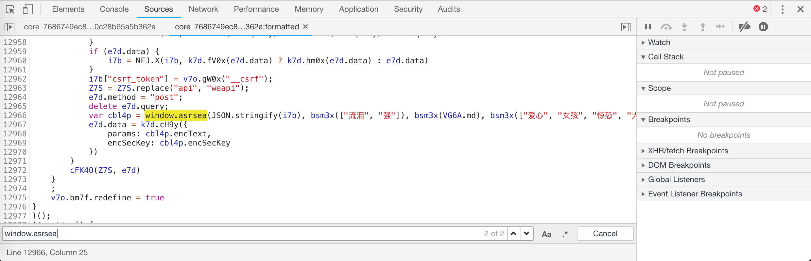
  
然后在12972(左边行号)设置断点，进行调试，看看四个参数的具体信息，command+R刷新页面观察显示，如图所示
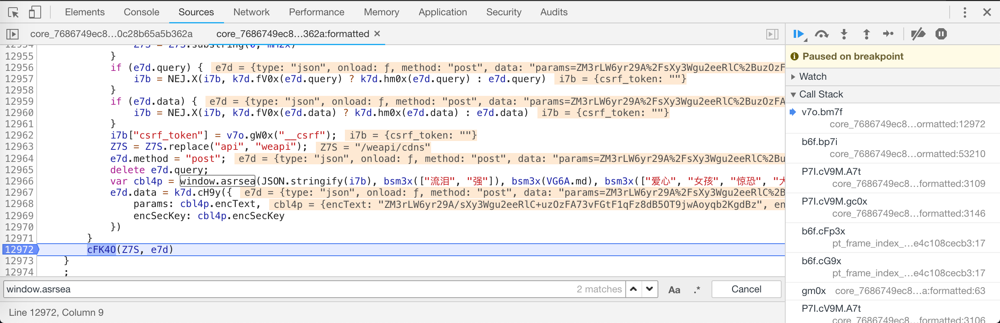
  
可以看到两个加密参数的值已经得到了，但是现在的重点是四个函数参数，可以在右边Watch中添加观察对象，也可以直接去Console去输出打印。这里为了方便，我采用第二种方式，切换到Console，输入四个参数，查看返回的打印。
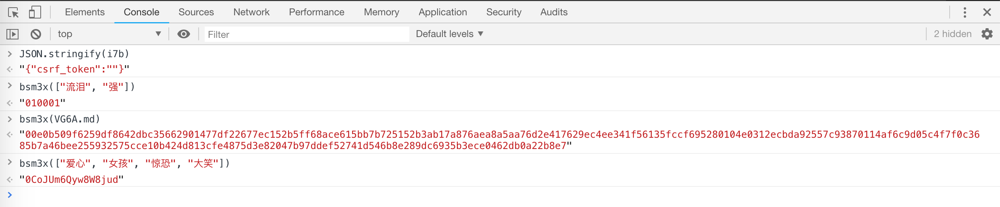
  
然后依法炮制，看看第二页，第三页等等调试后四个参数的信息，这里我贴出第四页的四个参数的信息
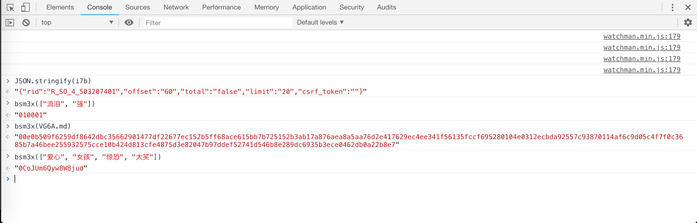
  
对比信息，似乎已经破解了四个参数背后的含义，为了方便描述，简单命名window.asrsea(q,w,e,r)，可以看出，w，e，r三个参数的值始终是不变，不管评论的页数有没有变化，而q参数是一个JSON对象的字符串，可以看到这个JSON对象包含以下属性：
```
1. "rid": R_SO_4_+歌曲id（实际上id可以为空，且这样对所有歌曲都有效）
2. "offset": 就是(页面-1)*20，和前面offset部分内容异曲同工
3. "total": false（除了首页），true（首页）
4. "limit": 定值20（一页20个评论）
5. "csrf_token": 空值即可
```
  
到现在已经知道四个参数qwer的含义和如何去构造值，接下来就是分析window.asrsea(q,w,e,r)的加密过程，重新观察刚刚贴的第二个代码段，这里为了理解方便，我直接写注释到代码段内，重新将代码段贴一次
```js
//argument a==随机字符串的长度
//return 返回一个随机字符串
function a(a) {
        var d, e, b = "abcdefghijklmnopqrstuvwxyzABCDEFGHIJKLMNOPQRSTUVWXYZ0123456789", c = "";
        for (d = 0; a > d; d += 1)//每次随机取得一个b[e]字符添加到字符串里
            e = Math.random() * b.length,
            e = Math.floor(e),
            c += b.charAt(e);
        return c
}
//arguments a,b
//加密方法AES加密，偏移量("0102030405060708")，模式CBC
//return 返回加密后字符串--密文
function b(a, b) {
        var c = CryptoJS.enc.Utf8.parse(b)
          , d = CryptoJS.enc.Utf8.parse("0102030405060708")//偏移量
          , e = CryptoJS.enc.Utf8.parse(a)
          , f = CryptoJS.AES.encrypt(e, c, {//AES加密，a是明文，b是密钥
            iv: d,
            mode: CryptoJS.mode.CBC//CBC模式
        });
        return f.toString()
}
//arguments abc
//加密方法RSA加密
//return 返回密文
function c(a, b, c) {
        var d, e;
        return setMaxDigits(131),
        d = new RSAKeyPair(b,"",c),//b,c是公钥
        e = encryptedString(d, a)//a是被加密对象
}
//arguments d,e,f,g=q,w,e,r 前面分析的四个参数
//调用两次b()AES加密，一次c()RSA加密
//返回 包含encText和encSecKey的对象h
//        encText就是请求参数params,encSeckey就是请求参数encSeckey
function d(d, e, f, g) {
        var h = {}
          , i = a(16);//i为通过a函数随机生成的大小为16的字符串
        return h.encText = b(d, g),//对参数1和参数4进行AES加密
        h.encText = b(h.encText, i),//对第一次AES加密的密文和随机字符串进行第二次AES加密
        h.encSecKey = c(i, e, f),//对随机字符串进行RSA加密，公钥是参数2和参数3
        h
}
function e(a, b, d, e) {
        var f = {};
        return f.encText = c(a + e, b, d),
        f
}
window.asrsea = d,
window.ecnonasr = e
```
  
终于搞明白加密的过程了，接下来就是仿照思路用python重新实现加密的过程，可以得到加密过后的请求参数params和encSeckey，然后POST请求发送
>http://music.163.com/weapi/v1/resource/comments/R_SO_4_ + 歌曲id + ?csrf_token=
  
对返回JSON数据取出我们需要的评论，其中包括普通评论，热门评论，回复评论等等。
  
#### 总结
  
  
在爬取歌曲评论的整个环节中，如何抓包，如何试验，如何去探索规律，都是十分耗时但挺有意思的。更多的一些细节，如何实现加密算法，对JSON数据的整理等等都已经在代码里注明了。
  
### 多线程，多进程的使用
  
  
在这里就不描述python里面的多线程和多进程，有很多优秀的资源可以去学习。我这里主要是看看利用多进程和多线程能不能有效的提高我的爬取效率。
  
因为多进程适合于处理计算密集型任务，多线程适用于处理IO密集型，为了方便对比，我决定直接爬取一首歌的评论，这里我爬取的是华晨宇的**烟火里的尘埃**这首歌，有7500多页的评论。我假设爬取1000页，那么我利用多进程来实现加密算法，计算这1000页评论的请求参数，再利用多线程去爬取页面的评论。但是多线程使用过程中，因为数据的共享，可能会发生错误，写代码的时候需要小心注意。
  
这里介绍我的思路，首先直接把之前的加密算法得到请求参数的函数直接搬过来，多进程池跑这个函数返回一个请求参数list。得到list之后，构造请求JSON数据的URL，多个线程去爬不同URL的请求返回的评论数据，得到评论后统一集中处理，不直接写入文件，以免多线程操作文件出错。更多的细节可以看一下代码。
  
这里我在教室跑了一下，1000页评论20000条评论，开的是4个进程4个线程，在运行的时候感觉大部分时间都用在了1000对请求参数的加密上，多线程爬取的时候非常快。一共耗时569.48s，大概有8分钟都在跑加密，剩下的1分多钟在爬取。之前没有使用多进程时，一次加密算法得到请求参数是1.1s-1.2s，所以1000页正常时间是1100s-1200s，现在是480s-500s。而之前单线程爬取1000页大概是180s-190s，现在是60s-80s。

到此说明，多进程和多线程方案是颇为有效的，在4进程4线程的情况下缩短到了一半以下接近三分之一的时间。

而且幸运的是，加密算法跑出来的请求参数的list可以适用于所有歌曲，不需要二次重复计算，所以如果我的目标是爬取某一位歌手所有歌曲下的评论来进行词云分析（打个比方），这样的话，在计算好加密算法后，后面爬取任何歌曲的时间都会十分的短暂。
  
下面是运行时的监控截图，都已经达到顶峰。
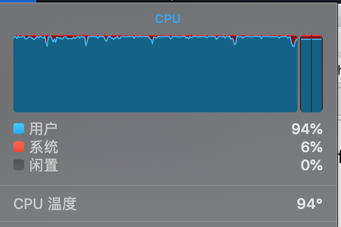
  
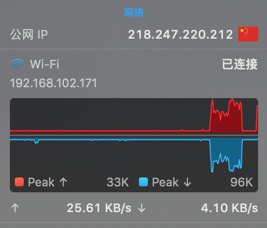
  
## 结尾
  
  
本次爬虫作业大概的工作就这么多，python爬虫也有丰富的资源可以学习，代码里面很多东西都没有整合，主要还是以边做边学为主，想到什么就去查然后实践搞搞，还是有许多的不足。
  
  
  
  
  

  
  
  
  
  
  
  
  